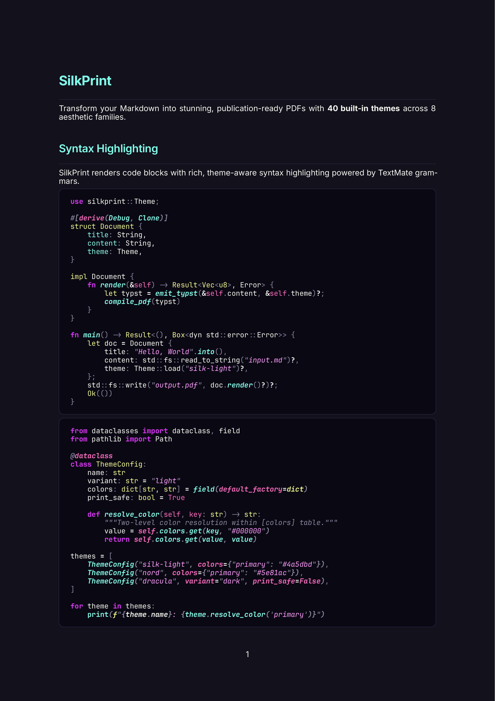
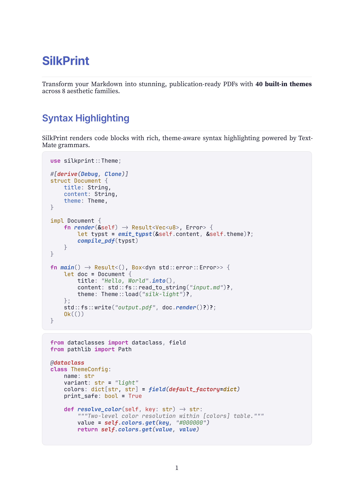
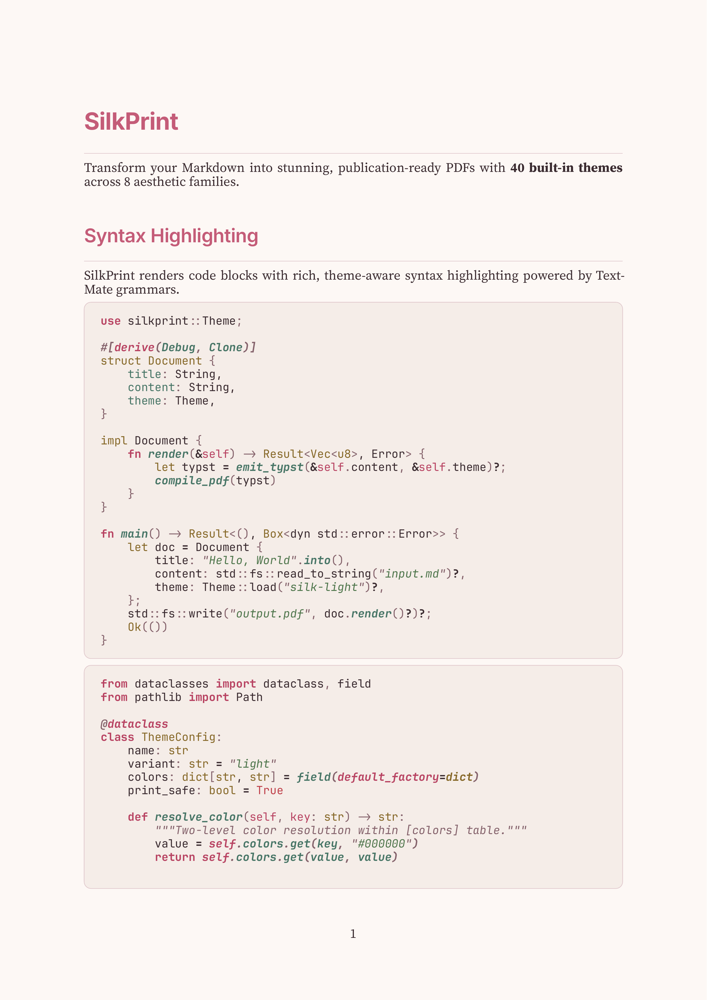
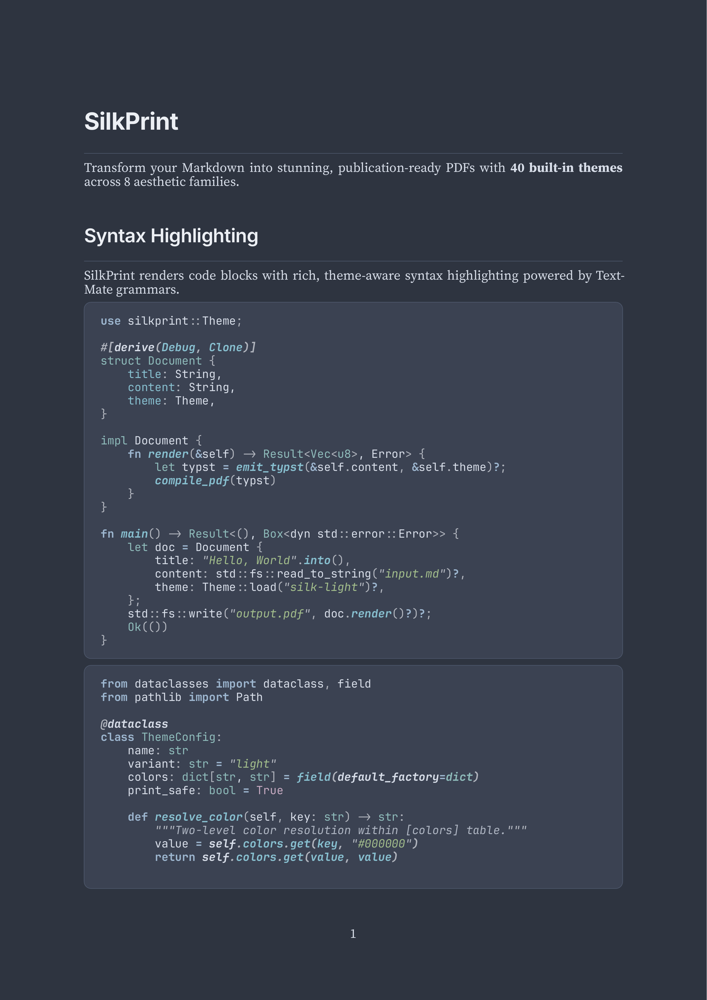
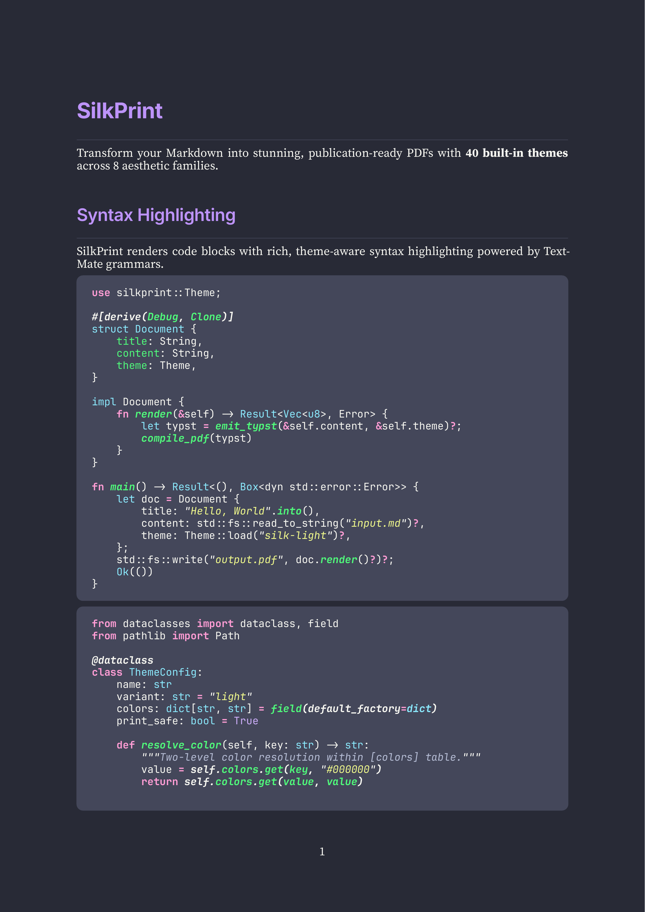

<h1 align="center">
  <br>
  💎 silkprint
  <br>
</h1>

<p align="center">
  <strong>Transform Markdown into stunning, publication-ready PDFs</strong>
</p>

<p align="center">
  <a href="#-quick-start">
    
  </a>
  <a href="#-theme-gallery">
    
  </a>
  <a href="#-features">
    
  </a>
</p>

<p align="center">
  <a href="#-quick-start">Quick Start</a> &bull;
  <a href="#-features">Features</a> &bull;
  <a href="#-theme-gallery">Theme Gallery</a> &bull;
  <a href="#-cli-reference">CLI Reference</a> &bull;
  <a href="#-custom-themes">Custom Themes</a>
</p>

---

<p align="center">
  
</p>

## ⚡ Quick Start

```bash
# Install from source (requires Rust 1.85+)
cargo install --path .

# Render a Markdown file to PDF
silkprint document.md

# Choose a theme
silkprint document.md --theme nord

# See all 40 themes
silkprint --list-themes
```

## 💎 Features

- **40 built-in themes** across 8 aesthetic families — from electric neon to academic serif
- **Rich syntax highlighting** for 20+ languages via TextMate grammars
- **GitHub-style alerts** — note, tip, important, warning, caution with themed icons
- **Typst-native math** — inline and display equations, matrices, Greek letters
- **Tables** with header styling, alternating row stripes, and column alignment
- **YAML front matter** — title, subtitle, author, date, theme, TOC control
- **Title pages** — auto-generated from front matter metadata
- **Table of contents** — configurable depth and styling
- **Footnotes** — Typst-native with auto-numbering and page placement
- **Task lists, description lists, wikilinks, emoji shortcodes**
- **Print-safe themes** validated with WCAG contrast checks
- **Custom themes** via TOML with 24 configurable sections
- **Color emoji** support via bundled Noto Color Emoji

## 🎨 Theme Gallery

SilkPrint ships with **40 themes** across 8 families. Every theme controls typography, colors, syntax highlighting, spacing, and component styling.

### Light Themes

<table>
<tr>
<td width="50%"></td>
<td width="50%"></td>
</tr>
<tr>
<td align="center"><strong>silk-light</strong> — Clean serif elegance</td>
<td align="center"><strong>sakura</strong> — Cherry blossom pink</td>
</tr>
</table>

### Dark Themes

<table>
<tr>
<td width="50%"></td>
<td width="50%"></td>
</tr>
<tr>
<td align="center"><strong>silkcircuit-neon</strong> — Electric purple + cyan</td>
<td align="center"><strong>nord</strong> — Arctic blue-grey calm</td>
</tr>
<tr>
<td width="50%"></td>
<td width="50%"></td>
</tr>
<tr>
<td align="center"><strong>dracula</strong> — Dark purple elegance</td>
<td align="center"><strong>catppuccin-mocha</strong> — Warm soothing pastels</td>
</tr>
</table>

### All 40 Themes

| Family | Themes | Variants |
|:-------|:-------|:---------|
| **Signature** | silk-light, silk-dark, manuscript, monochrome | Light + Dark |
| **SilkCircuit** | silkcircuit-dawn, neon, vibrant, soft, glow | Dark + Dawn |
| **Developer** | nord, dracula, solarized-light/dark, catppuccin-latte/mocha, gruvbox-light/dark, tokyo-night, rose-pine | Mixed |
| **Classic** | academic, typewriter, newspaper, parchment | Light |
| **Nature** | forest, ocean, sunset, arctic, sakura | Mixed |
| **Futuristic** | cyberpunk, terminal, hologram, synthwave, matrix | Dark |
| **Artistic** | noir, candy, blueprint, witch | Mixed |
| **Greyscale** | greyscale-warm, greyscale-cool, high-contrast | Light |

Use `silkprint --list-themes` to see descriptions, variants, and print-safe status.

## 🔮 CLI Reference

```
silkprint [OPTIONS] [INPUT]

Arguments:
  [INPUT]               Markdown file to render

Options:
  -o, --output <PATH>   Output path ("-" for stdout) [default: <input-stem>.pdf]
  -t, --theme <NAME>    Theme name or path to .toml file [default: silkcircuit-dawn]
  -p, --paper <SIZE>    Paper size: a4, letter, a5, legal [default: a4]
      --list-themes     List all available themes
      --check           Validate input + theme without rendering
      --dump-typst      Emit generated Typst markup instead of PDF
      --open            Open PDF in system viewer after rendering
      --toc             Force-enable table of contents
      --no-toc          Force-disable table of contents
      --no-title-page   Suppress title page
      --font-dir <DIR>  Additional font search directory
  -v, --verbose...      Increase verbosity (-v, -vv, -vvv)
  -q, --quiet           Suppress all output except errors
```

### Examples

```bash
# Render with a specific theme and paper size
silkprint report.md --theme academic --paper letter -o report.pdf

# Preview — render and open in system viewer
silkprint notes.md --theme silk-light --open

# Validate without rendering (CI-friendly)
silkprint document.md --check

# Inspect generated Typst markup
silkprint document.md --dump-typst > output.typ

# Write PDF to stdout (piping)
silkprint document.md -o - | lpr
```

### Front Matter

```yaml
---
title: My Document
subtitle: A Detailed Analysis
author: Jane Doe
date: 2025-06-15
theme: nord
toc: true
paper: letter
---
```

## 🪄 Custom Themes

Create a `.toml` file with 24 configurable sections:

```toml
[meta]
name = "My Theme"
version = "1"
variant = "light"
print_safe = true

[colors]
primary    = "#4a5dbd"
background = "#ffffff"
text       = "#1a1a2e"

[fonts]
heading = "Inter"
body    = "Source Serif 4"
mono    = "JetBrains Mono"

[text]
color         = "text"
line_height   = 1.4
paragraph_gap = "0.65em"
justification = "justify"

[headings]
color = "primary"
font  = "heading"

[code_block]
background = "#f8f8fc"
border     = "#e2e2e8"

[syntax]
background = "#f8f8fc"
keyword    = { color = "#7c3aed", bold = true }
string     = { color = "#059669", italic = true }
comment    = { color = "#9ca3af", italic = true }
function   = { color = "#2563eb", bold = true }
# ... 12 more token types
```

Use it: `silkprint document.md --theme ./my-theme.toml`

Full schema reference: see [`CLAUDE.md`](CLAUDE.md) or any built-in theme in [`themes/`](themes/).

## 🏗️ Architecture

```
Markdown → comrak AST → Typst markup → World trait compile → PDF
```

| Stage | Component | Technology |
|:------|:----------|:-----------|
| Parse | Markdown → AST | comrak 0.50 (GFM + extensions) |
| Theme | TOML → tokens | serde + two-level color resolution |
| Emit | AST → Typst | Custom emitter with theme-aware styling |
| Compile | Typst → PDF | typst 0.14 via World trait |

## 🧪 Development

```bash
cargo check            # Type-check
cargo clippy           # Lint (pedantic)
cargo test             # Run all tests
cargo run -- --help    # CLI help
```

Requires **Rust 1.85+** (edition 2024).

---

<p align="center">
  <a href="https://github.com/hyperb1iss/silkprint">
    
  </a>
</p>

<p align="center">
  <sub>
    ✦ Built with obsession by <a href="https://hyperbliss.tech"><strong>Hyperbliss Technologies</strong></a> ✦
  </sub>
</p>
