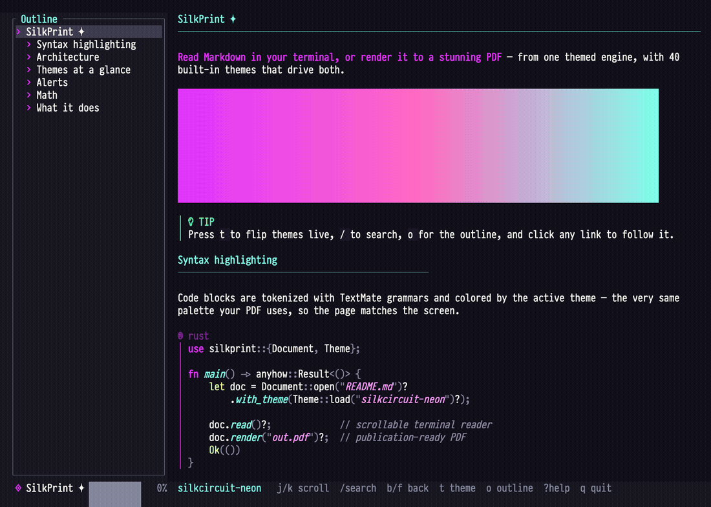
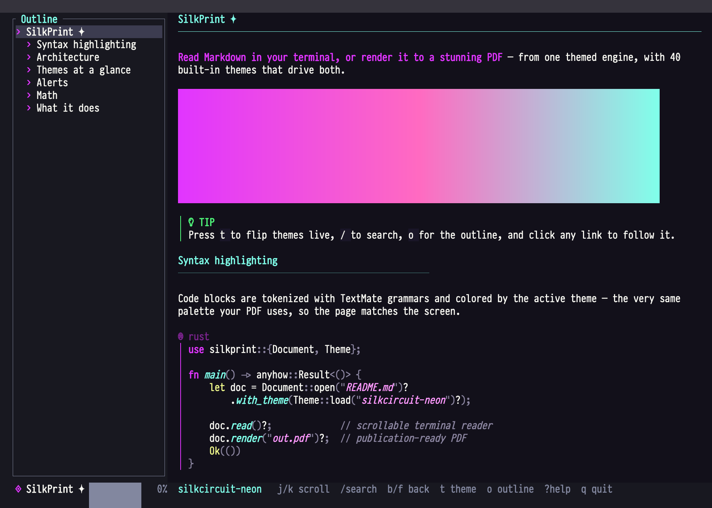
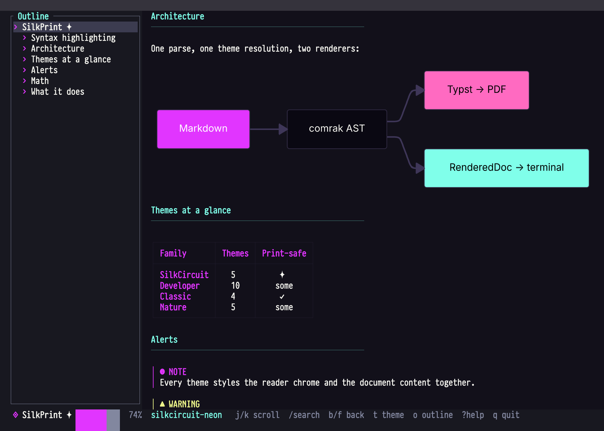
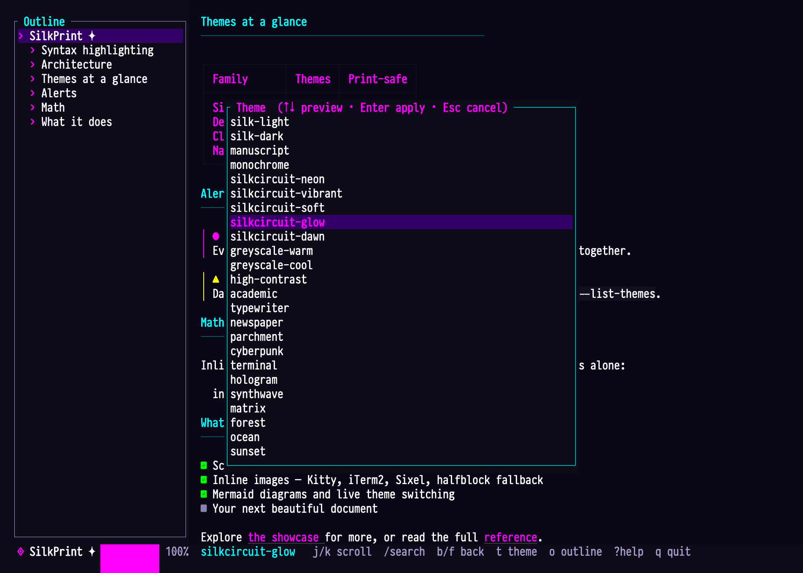
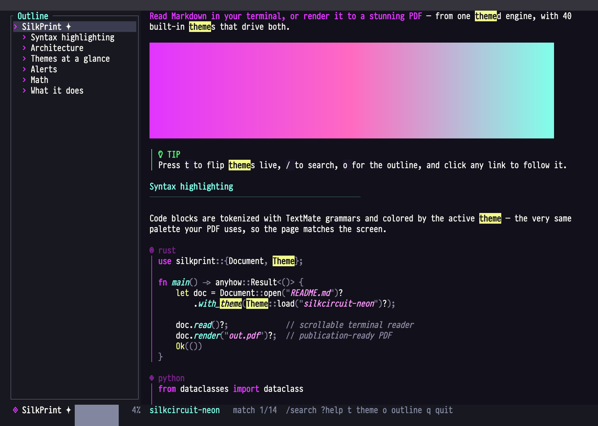
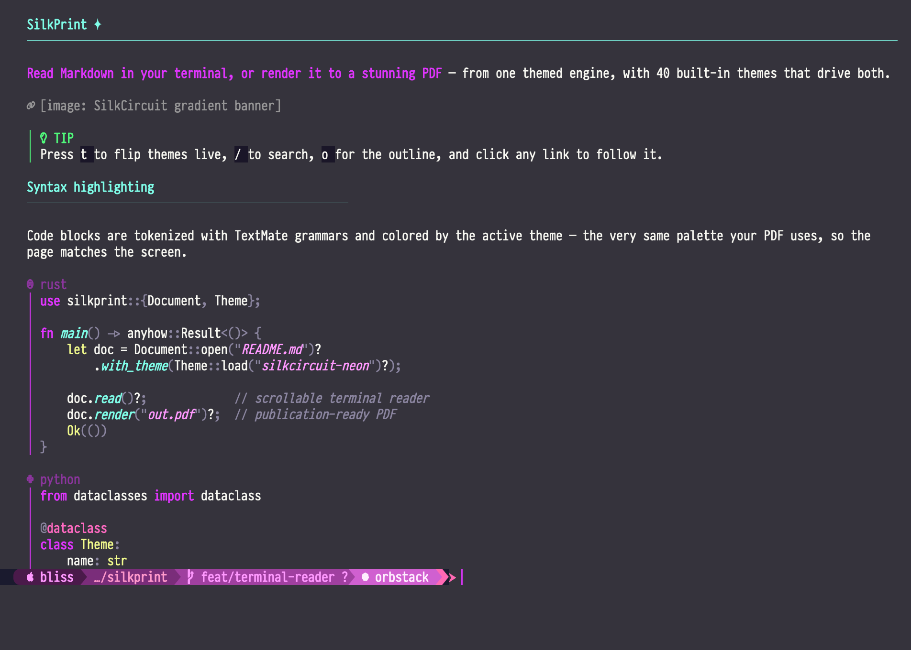
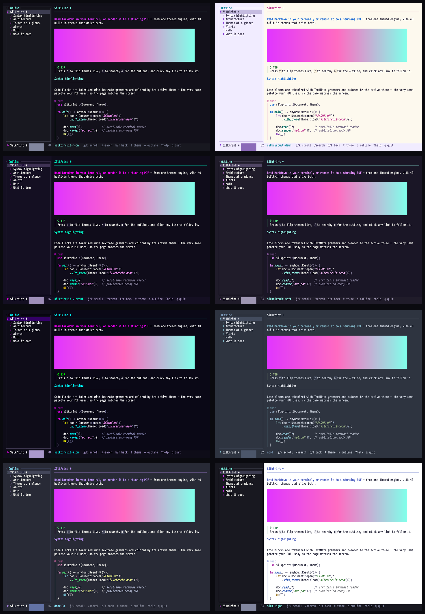
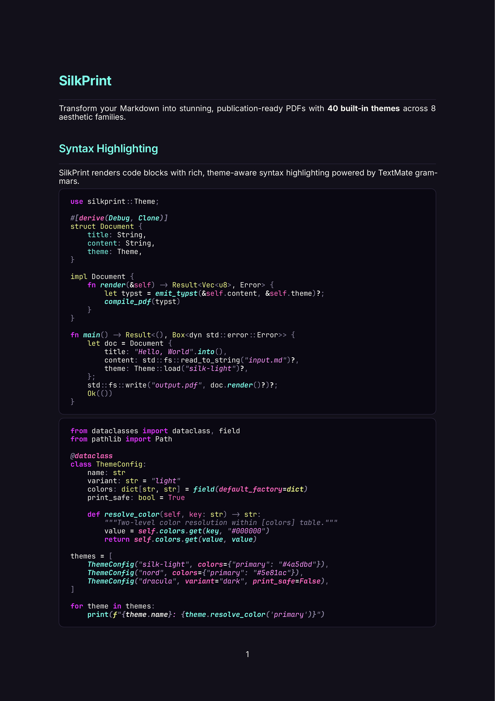
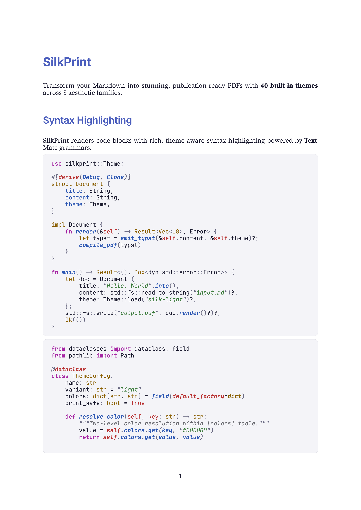

<div align="center">

# 💎 silkprint

### Read Markdown in your terminal — or render it to a stunning PDF.

One themed engine. Forty themes. Two beautiful destinations.

<p>
  <a href="#-the-terminal-reader"></a>
  <a href="#-themes"></a>
  <a href="#-pdf-output"></a>
  <a href="#-the-terminal-reader"></a>
</p>

<br>



<br>

<sub>scroll · mermaid diagrams · live theme switching across the SilkCircuit family · search — all in your terminal</sub>

<br><br>

<a href="#-quick-start">Quick Start</a> &nbsp;·&nbsp;
<a href="#-the-terminal-reader">Terminal Reader</a> &nbsp;·&nbsp;
<a href="#-themes">Themes</a> &nbsp;·&nbsp;
<a href="#-pdf-output">PDF Output</a> &nbsp;·&nbsp;
<a href="#-cli-reference">CLI</a> &nbsp;·&nbsp;
<a href="#-custom-themes">Custom Themes</a>

</div>

---

**silkprint** turns Markdown into something beautiful, two ways, from a single
themed engine. A rich **terminal reader** for everyday reading, and
**publication-ready PDFs** when you need a document. The same 40 themes drive
both, so what you read in your terminal is exactly what lands on the page.

## ⚡ Quick Start

```bash
# Install from source (requires Rust 1.96+)
cargo install --path .

# Read a Markdown file in your terminal (scrollable reader)
silkprint README.md

# Pipe styled Markdown anywhere
silkprint CHANGELOG.md | less -R

# Render a PDF — the `pdf` subcommand, or just add -o
silkprint pdf report.md --theme nord
silkprint report.md -o report.pdf

# Browse all 40 themes
silkprint --list-themes
```

A bare `silkprint <file>` **reads in your terminal**: the interactive reader in
a TTY, styled one-shot ANSI when piped. PDF rendering kicks in with the `pdf`
subcommand or any PDF flag (`-o`, `--check`, `--dump-typst`, `--open`).

## 📖 The Terminal Reader

`silkprint <file>` opens a scrollable reader built on the very same themed
pipeline as the PDF path. Headings, code, tables, alerts, **images**, and
**diagrams** all render with your chosen theme; the chrome is themed to match.



### Everything renders

<table>
<tr>
<td width="50%" valign="top"></td>
<td width="50%" valign="top"></td>
</tr>
<tr>
<td align="center"><strong>Mermaid diagrams</strong>, tables &amp; alerts — inline</td>
<td align="center"><strong>Live theme picker</strong> — instant preview, no restart</td>
</tr>
<tr>
<td width="50%" valign="top"></td>
<td width="50%" valign="top"></td>
</tr>
<tr>
<td align="center"><strong>Search</strong> with highlighted matches</td>
<td align="center"><strong>Pipe-friendly</strong> one-shot ANSI</td>
</tr>
</table>

- **Inline images** via the Kitty, iTerm2, and Sixel graphics protocols, with a
  Unicode halfblock fallback elsewhere — local and remote.
- **Mermaid diagrams** rendered to images, right in the flow.
- **Live theme picker** (`t`) with instant preview across all 40 themes.
- **Syntax highlighting** driven by the theme's own palette — the same colors
  as the PDF, classified from TextMate scopes.
- **Outline sidebar** for jump-to-heading navigation, plus in-document search.
- **Follow links**: click a relative `.md` link to open it in the reader, with
  **back/forward history**; external URLs open in your browser.
- **Live reload** — edit the file and the reader re-renders on save.
- **OSC 8 hyperlinks**, full **mouse** support, and graceful degradation across
  color depth (truecolor → 256 → 16 → none) and glyphs (Nerd Font → Unicode →
  ASCII).
- Remembers your theme, outline visibility, and glyph tier between sessions.

### Keys

| Key | Action | | Key | Action |
|:----|:-------|---|:----|:-------|
| `j` `k` `↑` `↓` | scroll a line | | `/` `n` `N` | search, next / prev |
| `Ctrl-d` `Ctrl-u` | half page | | `t` | theme picker (live) |
| `Space` `PgUp/Dn` | page | | `o` | toggle outline |
| `g g` / `G` | top / bottom | | `Tab` | switch focus |
| `b` `f` `Bksp` | history back / forward | | `?` | help |
| click a link | follow `.md` / open URL | | `q` `Esc` | quit |

The mouse scrolls, clicks links and outline entries, and drags to scroll.

## 🎨 Themes

**40 themes across 8 families** — and every one styles *both* the terminal
reader and the PDF. The SilkCircuit family alone spans five moods:



<div align="center"><sub>top to bottom: silkcircuit-neon · dawn · vibrant · soft · glow · nord · dracula · silk-light</sub></div>

| Family | Themes | Variants |
|:-------|:-------|:---------|
| **Signature** | silk-light, silk-dark, manuscript, monochrome | Light + Dark |
| **SilkCircuit** | silkcircuit-dawn, neon, vibrant, soft, glow | Dark + Dawn |
| **Developer** | nord, dracula, solarized-light/dark, catppuccin-latte/mocha, gruvbox-light/dark, tokyo-night, rose-pine | Mixed |
| **Classic** | academic, typewriter, newspaper, parchment | Light |
| **Nature** | forest, ocean, sunset, arctic, sakura | Mixed |
| **Futuristic** | cyberpunk, terminal, hologram, synthwave, matrix | Dark |
| **Artistic** | noir, candy, blueprint, witch | Mixed |
| **Greyscale** | greyscale-warm, greyscale-cool, high-contrast | Light |

Run `silkprint --list-themes` for descriptions, variants, and print-safe status.

## 📄 PDF Output

The same Markdown, the same theme — rendered through Typst to a crisp,
publication-ready PDF.

<table>
<tr>
<td width="50%"></td>
<td width="50%"></td>
</tr>
<tr>
<td align="center"><strong>silkcircuit-neon</strong></td>
<td align="center"><strong>silk-light</strong></td>
</tr>
</table>

```bash
silkprint pdf document.md --theme academic --paper letter -o report.pdf
silkprint document.md --open          # render + open in the system viewer
silkprint document.md --check         # validate without rendering (CI-friendly)
silkprint document.md -o - | lpr      # stream the PDF
```

- **Syntax highlighting** for 20+ languages via TextMate grammars
- **GitHub-style alerts**, **Typst-native math**, **tables** with striping &amp; alignment
- **YAML front matter** → title pages, **table of contents**, **footnotes**
- **Print-safe themes** validated with WCAG contrast checks
- **Color emoji** via bundled Noto Color Emoji

```yaml
---
title: My Document
author: Jane Doe
date: 2026-05-31
theme: nord
toc: true
paper: letter
---
```

## 🔮 CLI Reference

```
silkprint [OPTIONS] [FILE]            Read [FILE] in the terminal (TUI),
                                      or emit one-shot ANSI when piped
silkprint pdf [OPTIONS] [FILE]        Render [FILE] to a PDF
silkprint read [OPTIONS] [FILE]       Force the reader (TUI or one-shot ANSI)
silkprint --list-themes               List all themes and exit

Reader options:
      --glyphs <MODE>   Glyph tier: nerdfont (default), unicode, ascii
      --no-images       Disable inline image rendering
      --plain           Force one-shot ANSI even in an interactive terminal
      --width <COLS>    Wrap one-shot output to COLS columns

PDF options:
  -o, --output <PATH>   Output path ("-" for stdout). Implies PDF [default: <stem>.pdf]
  -p, --paper <SIZE>    Paper size: a4, letter, a5, legal [default: a4]
      --check           Validate input + theme without rendering. Implies PDF
      --dump-typst      Emit generated Typst markup instead of a PDF. Implies PDF
      --open            Open the PDF in the system viewer. Implies PDF
      --toc / --no-toc  Force table of contents on / off
      --no-title-page   Suppress the title page

Shared options:
  -t, --theme <NAME>    Theme name or path to a .toml file [default: silkcircuit-dawn]
      --font-dir <DIR>  Additional font search directory
      --color <WHEN>    Color output: auto, always, never [default: auto]
  -v, --verbose...      Increase verbosity (-v, -vv, -vvv)
  -q, --quiet           Suppress all output except errors
```

> **Coming from a PDF-first workflow?** A bare `silkprint file.md` now opens the
> reader instead of writing a PDF. Use `silkprint pdf file.md`, or add `-o`.

## 🪄 Custom Themes

Drop a `.toml` file with 24 configurable sections — it works everywhere a theme
name does, terminal *and* PDF:

```toml
[meta]
name = "My Theme"
variant = "light"
print_safe = true

[colors]
primary    = "#4a5dbd"
background = "#ffffff"
text       = "#1a1a2e"

[headings]
color = "primary"

[syntax]
keyword  = { color = "#7c3aed", bold = true }
string   = { color = "#059669", italic = true }
comment  = { color = "#9ca3af", italic = true }
# ... 13 more token types
```

```bash
silkprint document.md --theme ./my-theme.toml          # read it
silkprint pdf document.md --theme ./my-theme.toml      # render it
```

Full schema: see [`AGENTS.md`](AGENTS.md) or any built-in theme in [`themes/`](themes/).

## 🏗️ Architecture

One Markdown parse and one theme resolution feed two renderers:

```
                       ┌─ Typst markup → World compile → PDF
Markdown → comrak AST ─┤
                       └─ terminal walker → RenderedDoc → ANSI / TUI
```

| Stage | Component | Technology |
|:------|:----------|:-----------|
| Parse | Markdown → AST | comrak 0.50 (GFM + extensions) |
| Theme | TOML → tokens | serde + two-level color resolution |
| PDF | AST → Typst → PDF | custom emitter + typst 0.14 via World trait |
| Terminal | AST → `RenderedDoc` → ANSI | width-independent role model + ratatui TUI |

The terminal renderer stores semantic style *roles* rather than colors, so a
live theme switch only re-resolves styles — it never re-walks the source.

## 🧪 Development

```bash
cargo check                  # type-check
cargo clippy                 # lint (pedantic)
cargo test                   # run all tests
cargo run -- README.md       # read this file in the terminal
```

Requires **Rust 1.96+** (edition 2024). The terminal reader lives behind the
default `terminal` feature; `--no-default-features` builds a PDF-only library.

---

<div align="center">
  <a href="https://github.com/hyperb1iss/silkprint"></a>
  <br><br>
  <sub>✦ Built with obsession by <a href="https://hyperbliss.tech"><strong>Hyperbliss Technologies</strong></a> ✦</sub>
</div>
