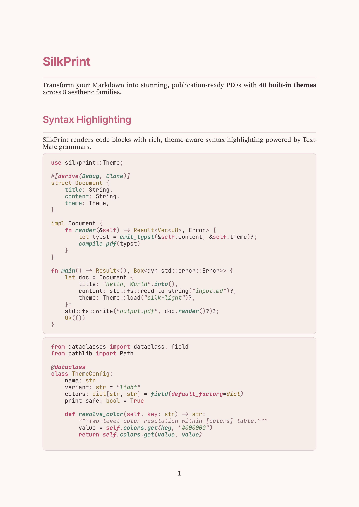
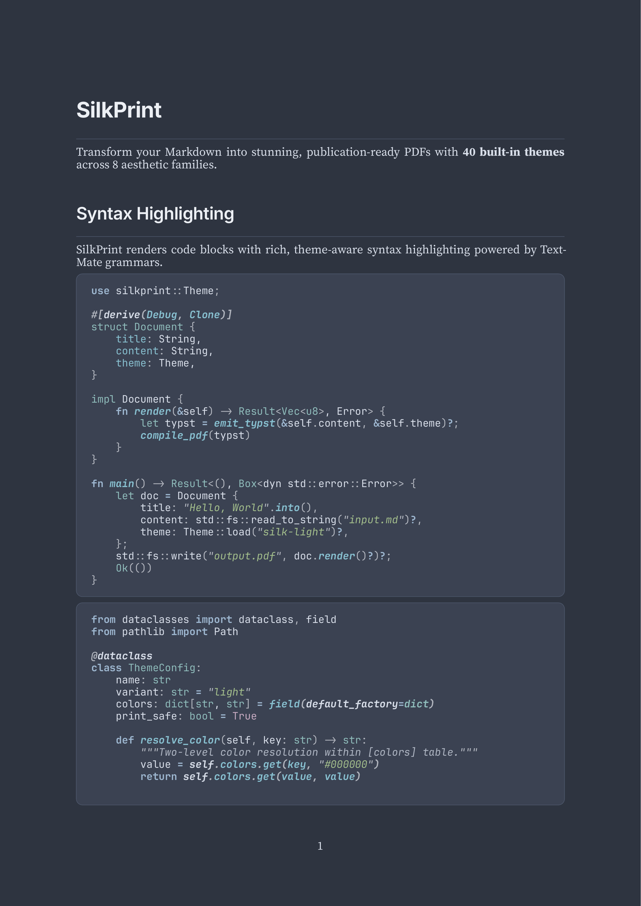
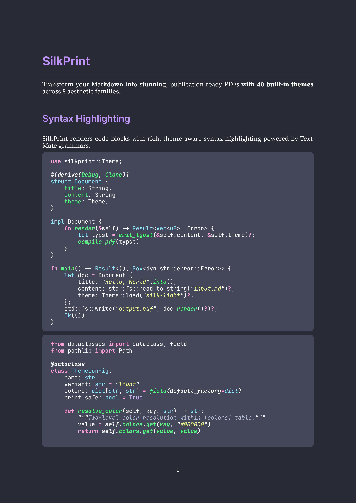
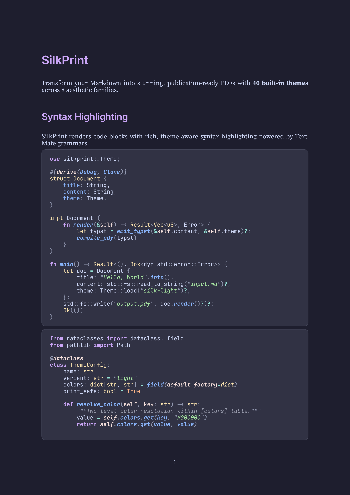

<h1 align="center">
  <br>
  💎 silkprint
  <br>
</h1>

<p align="center">
  <strong>Read Markdown in your terminal, or render it to a stunning PDF</strong>
</p>

<p align="center">
  <a href="#-terminal-reader">
    
  </a>
  <a href="#-theme-gallery">
    
  </a>
  <a href="#-pdf-output">
    
  </a>
</p>

<p align="center">
  <a href="#-quick-start">Quick Start</a> &bull;
  <a href="#-terminal-reader">Terminal Reader</a> &bull;
  <a href="#-pdf-output">PDF Output</a> &bull;
  <a href="#-theme-gallery">Theme Gallery</a> &bull;
  <a href="#-cli-reference">CLI Reference</a> &bull;
  <a href="#-custom-themes">Custom Themes</a>
</p>

---

SilkPrint turns Markdown into something beautiful in two directions from a single
themed engine: a rich **terminal reader** for everyday reading, and
**publication-ready PDFs** when you need a document. The same 40 themes drive
both, so what you read in your terminal is exactly what you get on the page.

## ⚡ Quick Start

```bash
# Install from source (requires Rust 1.96+)
cargo install --path .

# Read a Markdown file in your terminal (scrollable TUI)
silkprint README.md

# Pipe styled Markdown into anything
silkprint CHANGELOG.md | less -R

# Render a PDF — use the `pdf` subcommand, or just add -o
silkprint pdf report.md --theme nord
silkprint report.md -o report.pdf

# See all 40 themes
silkprint --list-themes
```

A bare `silkprint <file>` reads in your terminal: it opens the interactive
reader in a TTY and emits styled one-shot ANSI when piped. PDF rendering kicks
in with the `pdf` subcommand or any PDF flag (`-o`, `--check`, `--dump-typst`,
`--open`).

## 📖 Terminal Reader

`silkprint <file>` opens a scrollable reader built on the same themed pipeline as
the PDF path. Headings, code, tables, alerts, and images render with your chosen
theme; the chrome (outline, status bar, popups) is themed to match.

- **Inline images** via the Kitty, iTerm2, and Sixel graphics protocols, with a
  Unicode halfblock fallback elsewhere — local and remote.
- **Mermaid diagrams** rendered to images, right in the flow.
- **Live theme picker** (`t`) with instant preview across all 40 themes — no
  restart, no config edit.
- **Syntax highlighting** driven by the theme's own palette (the same colors as
  the PDF), classified from TextMate scopes.
- **Outline sidebar** for jump-to-heading navigation, plus in-document search.
- **Follow links**: click a relative `.md` link to open it in the reader, with
  **back/forward history**; external URLs open in your browser.
- **Live reload** — edit the file and the reader re-renders on save.
- **OSC 8 hyperlinks**, full **mouse** support, and graceful degradation across
  color depth (truecolor → 256 → 16 → none) and glyphs (Nerd Font → Unicode →
  ASCII).
- Remembers your theme, outline visibility, and glyph tier between sessions.

### Keys

| Key | Action |
|:----|:-------|
| `j` / `k`, `↑` / `↓` | Scroll a line |
| `Ctrl-d` / `Ctrl-u` | Half page down / up |
| `Space` / `PgDn`, `PgUp` | Page down / up |
| `g g` / `G` | Top / bottom |
| `o` | Toggle the outline sidebar |
| `Tab` | Switch focus (content ↔ outline) |
| `Enter` | Jump to the selected heading (in outline) |
| click a link | Follow a local `.md` link in-reader, or open a URL |
| `b` / `f`, `Bksp` | History back / forward |
| `/` then `n` / `N` | Search, next / previous match |
| `t` | Theme picker (live preview, `Enter` apply, `Esc` cancel) |
| `?` | Help overlay |
| `q` / `Esc` | Quit |

The mouse scrolls, clicks links and outline entries, and drags to scroll.

### Reader options

```
silkprint [OPTIONS] <FILE>       # read in a TTY, one-shot ANSI when piped
silkprint read [OPTIONS] <FILE>  # same, forced (handy in scripts)

  -t, --theme <NAME>      Theme name or path to .toml (shared with PDF)
      --glyphs <MODE>     Glyph tier: nerdfont (default), unicode, ascii
      --no-images         Disable inline image rendering
      --plain             Force one-shot ANSI even in an interactive terminal
      --width <COLS>      Wrap one-shot output to COLS (default: terminal width)
      --color <WHEN>      Color: auto, always, never
```

Glyph tier also reads `SILKPRINT_GLYPHS`; color honors `NO_COLOR`. Saved
preferences live at `~/.config/silkprint/reader.toml`.

## 📄 PDF Output

```bash
# Explicit subcommand, or any PDF flag on the bare form
silkprint pdf document.md --theme academic --paper letter -o report.pdf
silkprint document.md -o report.pdf

# Preview — render and open in the system viewer
silkprint document.md --theme silk-light --open

# Validate without rendering (CI-friendly)
silkprint document.md --check

# Inspect the generated Typst markup
silkprint document.md --dump-typst > output.typ

# Write the PDF to stdout (piping)
silkprint document.md -o - | lpr
```

- **Rich syntax highlighting** for 20+ languages via TextMate grammars
- **GitHub-style alerts** — note, tip, important, warning, caution with icons
- **Typst-native math** — inline and display equations, matrices, Greek letters
- **Tables** with header styling, alternating row stripes, and column alignment
- **YAML front matter** — title, subtitle, author, date, theme, TOC control
- **Title pages** auto-generated from front matter metadata
- **Table of contents** with configurable depth and styling
- **Footnotes**, task lists, description lists, wikilinks, emoji shortcodes
- **Print-safe themes** validated with WCAG contrast checks
- **Color emoji** via bundled Noto Color Emoji

### Front Matter

```yaml
---
title: My Document
subtitle: A Detailed Analysis
author: Jane Doe
date: 2025-06-15
theme: nord
toc: true
paper: letter
---
```

## 🎨 Theme Gallery

SilkPrint ships with **40 themes** across 8 families. Every theme controls
typography, colors, syntax highlighting, spacing, and component styling — and
applies to **both** the terminal reader and the PDF.

### Light Themes

<table>
<tr>
<td width="50%"></td>
<td width="50%"></td>
</tr>
<tr>
<td align="center"><strong>silk-light</strong> — Clean serif elegance</td>
<td align="center"><strong>sakura</strong> — Cherry blossom pink</td>
</tr>
</table>

### Dark Themes

<table>
<tr>
<td width="50%"></td>
<td width="50%"></td>
</tr>
<tr>
<td align="center"><strong>silkcircuit-neon</strong> — Electric purple + cyan</td>
<td align="center"><strong>nord</strong> — Arctic blue-grey calm</td>
</tr>
<tr>
<td width="50%"></td>
<td width="50%"></td>
</tr>
<tr>
<td align="center"><strong>dracula</strong> — Dark purple elegance</td>
<td align="center"><strong>catppuccin-mocha</strong> — Warm soothing pastels</td>
</tr>
</table>

### All 40 Themes

| Family | Themes | Variants |
|:-------|:-------|:---------|
| **Signature** | silk-light, silk-dark, manuscript, monochrome | Light + Dark |
| **SilkCircuit** | silkcircuit-dawn, neon, vibrant, soft, glow | Dark + Dawn |
| **Developer** | nord, dracula, solarized-light/dark, catppuccin-latte/mocha, gruvbox-light/dark, tokyo-night, rose-pine | Mixed |
| **Classic** | academic, typewriter, newspaper, parchment | Light |
| **Nature** | forest, ocean, sunset, arctic, sakura | Mixed |
| **Futuristic** | cyberpunk, terminal, hologram, synthwave, matrix | Dark |
| **Artistic** | noir, candy, blueprint, witch | Mixed |
| **Greyscale** | greyscale-warm, greyscale-cool, high-contrast | Light |

Use `silkprint --list-themes` to see descriptions, variants, and print-safe status.

## 🔮 CLI Reference

```
silkprint [OPTIONS] [FILE]            Read [FILE] in the terminal (TUI),
                                      or emit one-shot ANSI when piped
silkprint pdf [OPTIONS] [FILE]        Render [FILE] to a PDF
silkprint read [OPTIONS] [FILE]       Force the reader (TUI or one-shot ANSI)
silkprint --list-themes               List all themes and exit

Reader options:
      --glyphs <MODE>   Glyph tier: nerdfont (default), unicode, ascii
      --no-images       Disable inline image rendering
      --plain           Force one-shot ANSI even in an interactive terminal
      --width <COLS>    Wrap one-shot output to COLS columns

PDF options:
  -o, --output <PATH>   Output path ("-" for stdout). Implies PDF [default: <stem>.pdf]
  -p, --paper <SIZE>    Paper size: a4, letter, a5, legal [default: a4]
      --check           Validate input + theme without rendering. Implies PDF
      --dump-typst      Emit generated Typst markup instead of a PDF. Implies PDF
      --open            Open the PDF in the system viewer. Implies PDF
      --toc             Force-enable table of contents
      --no-toc          Force-disable table of contents
      --no-title-page   Suppress the title page

Shared options:
  -t, --theme <NAME>    Theme name or path to a .toml file [default: silkcircuit-dawn]
      --font-dir <DIR>  Additional font search directory
      --color <WHEN>    Color output: auto, always, never [default: auto]
  -v, --verbose...      Increase verbosity (-v, -vv, -vvv)
  -q, --quiet           Suppress all output except errors
```

> **Migrating from a PDF-first workflow?** A bare `silkprint file.md` now opens
> the reader instead of writing a PDF. Use `silkprint pdf file.md` or add `-o`.

## 🪄 Custom Themes

Create a `.toml` file with 24 configurable sections:

```toml
[meta]
name = "My Theme"
version = "1"
variant = "light"
print_safe = true

[colors]
primary    = "#4a5dbd"
background = "#ffffff"
text       = "#1a1a2e"

[fonts]
heading = "Inter"
body    = "Source Serif 4"
mono    = "JetBrains Mono"

[text]
color         = "text"
line_height   = 1.4
paragraph_gap = "0.65em"
justification = "justify"

[headings]
color = "primary"
font  = "heading"

[code_block]
background = "#f8f8fc"
border     = "#e2e2e8"

[syntax]
background = "#f8f8fc"
keyword    = { color = "#7c3aed", bold = true }
string     = { color = "#059669", italic = true }
comment    = { color = "#9ca3af", italic = true }
function   = { color = "#2563eb", bold = true }
# ... 12 more token types
```

Use it anywhere a theme name goes — terminal or PDF:

```bash
silkprint document.md --theme ./my-theme.toml          # read it
silkprint pdf document.md --theme ./my-theme.toml      # render it
```

Full schema reference: see [`CLAUDE.md`](CLAUDE.md) or any built-in theme in [`themes/`](themes/).

## 🏗️ Architecture

One Markdown parse and one theme resolution feed two renderers:

```
                       ┌─ Typst markup → World compile → PDF
Markdown → comrak AST ─┤
                       └─ terminal walker → RenderedDoc → ANSI / TUI
```

| Stage | Component | Technology |
|:------|:----------|:-----------|
| Parse | Markdown → AST | comrak 0.50 (GFM + extensions) |
| Theme | TOML → tokens | serde + two-level color resolution |
| PDF | AST → Typst → PDF | custom emitter + typst 0.14 via World trait |
| Terminal | AST → `RenderedDoc` → ANSI | width-independent role model + ratatui TUI |

The terminal renderer stores semantic style *roles* rather than colors, so a
live theme switch only re-resolves styles — it never re-walks the source.

## 🧪 Development

```bash
cargo check                      # Type-check
cargo clippy                     # Lint (pedantic)
cargo test                       # Run all tests
cargo run -- --help              # CLI help
cargo run -- README.md           # Read this file in the terminal
```

Requires **Rust 1.96+** (edition 2024). The terminal reader lives behind the
default `terminal` feature; `--no-default-features` builds a PDF-only library.

---

<p align="center">
  <a href="https://github.com/hyperb1iss/silkprint">
    
  </a>
</p>

<p align="center">
  <sub>
    ✦ Built with obsession by <a href="https://hyperbliss.tech"><strong>Hyperbliss Technologies</strong></a> ✦
  </sub>
</p>
