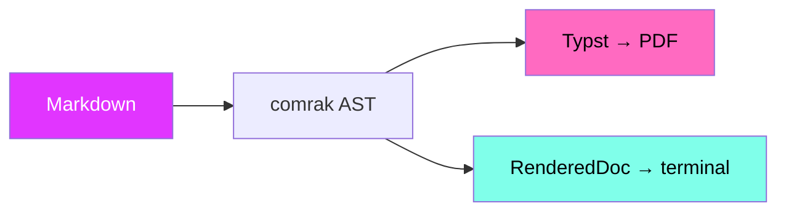

# SilkPrint ✦

**Read Markdown in your terminal, or render it to a stunning PDF** — from one
themed engine, with 40 built-in themes that drive both.


> [!TIP]
> Press `t` to flip themes live, `/` to search, `o` for the outline, and click
> any link to follow it.

## Syntax highlighting

Code blocks are tokenized with TextMate grammars and colored by the active
theme — the very same palette your PDF uses, so the page matches the screen.

```rust
use silkprint::{Document, Theme};

fn main() -> anyhow::Result<()> {
    let doc = Document::open("README.md")?
        .with_theme(Theme::load("silkcircuit-neon")?);

    doc.read()?;             // scrollable terminal reader
    doc.render("out.pdf")?;  // publication-ready PDF
    Ok(())
}
```

```python
from dataclasses import dataclass

@dataclass
class Theme:
    name: str
    variant: str = "dark"

    @property
    def print_safe(self) -> bool:
        return self.variant == "light"

picks = [Theme("silkcircuit-neon"), Theme("nord", "light")]
print([t.name for t in picks if t.print_safe])
```

## Architecture

One parse, one theme resolution, two renderers:



## Themes at a glance

| Family          | Themes | Print-safe |
|:----------------|:------:|:----------:|
| **SilkCircuit** |   5    |     ✦      |
| **Developer**   |  10    |    some    |
| **Classic**     |   4    |     ✓      |
| **Nature**      |   5    |    some    |

## Alerts

> [!NOTE]
> Every theme styles the reader chrome and the document content together.

> [!WARNING]
> Dark themes are gorgeous on screen but not print-safe — check `--list-themes`.

## Math

Inline math like $E = m c^2$ sits in the prose; display math stands alone:

$$ integral_0^infinity e^(-x^2) dif x = sqrt(pi) / 2 $$

## What it does

- [x] Scrollable terminal reader with an outline sidebar
- [x] Inline images — Kitty, iTerm2, Sixel, halfblock fallback
- [x] Mermaid diagrams and live theme switching
- [ ] Your next beautiful document

Explore [the showcase](showcase.md) for more, or read the full
[reference](../README.md).
