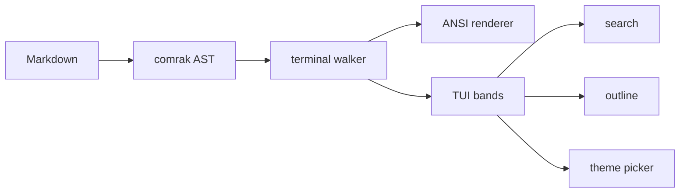
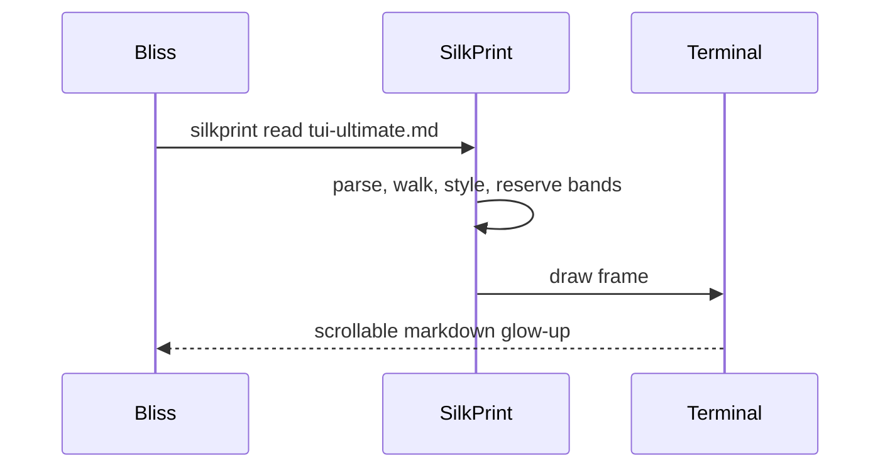
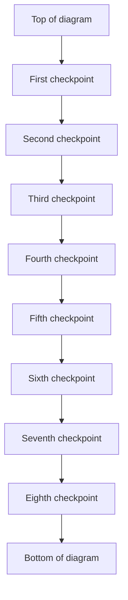
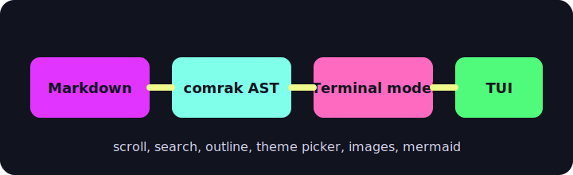

# Ultimate TUI Torture Garden

This file is tuned for `silkprint read`: scroll behavior, outline jumps, search,
code highlighting, HTML lowering, callouts, tables, image bands, Mermaid
diagrams, footnotes, field stacks, wrapping, and graceful fallbacks.

Use it when the reader looks good on ordinary docs and you want something
gnarly enough to shake loose layout bugs.

## Quick Smoke Targets

**Reader mode:** interactive TUI with images enabled.
**Plain mode:** `silkprint read tests/fixtures/tui-ultimate.md --plain`.
**Search terms:** `needle`, `Mermaid`, `blocked`, `wrapstress`, `footnote`.
**Theme picker:** flip between light, dark, and neon themes over image sections.
**Outline:** jump between every heading level and confirm scroll clamp behavior.

## Heading Ladder

# H1 Duplicate Stress

## H2 Duplicate Stress

### H3 Duplicate Stress

#### H4 Duplicate Stress

##### H5 Duplicate Stress

###### H6 Duplicate Stress

## Inline Styling Matrix

Plain text with **bold**, *italic*, ***bold italic***, ~~strikethrough~~,
`inline code`, ==highlighted text==, H~2~O, E = mc^2^, and a literal escaped
\*asterisk\* that should not become emphasis.

Nested emphasis should stay readable: **bold outside with *italic inside* and
`code` nearby**, then *italic outside with **bold inside** and a [link](https://example.com)*.

Emoji shortcodes should lower to emoji where supported: :sparkles: :heart:
:warning: :white_check_mark: :memo:

Unicode width stress: cafe, naive, Jalapeno, lambda λ, arrows -> => <-, box
drawing ┌─┬─┐, and wide glyphs 漢字かな.

wrapstress-wrapstress-wrapstress-wrapstress-wrapstress-wrapstress-wrapstress-wrapstress-wrapstress
is a deliberately long token. The line after it is ordinary prose so wrapping
can recover without pushing later blocks sideways.

## Links And Targets

Inline link: [SilkPrint](https://github.com/hyperb1iss/silkprint).

Autolink: <https://typst.app/docs/reference/>.

Reference link: [comrak][comrak].

Wikilink: [[reader-outline]] and aliased [[reader-theme-picker|theme picker]].

[comrak]: https://github.com/kivikakk/comrak "comrak markdown parser"

## Field Stack

**Status:** Ready for visual inspection
**Renderer:** Terminal model to ANSI or TUI
**Theme:** Front matter default plus live theme picker
**Images:** Local raster, vector placeholder, missing file, and blocked remote

## Lists: Tight, Loose, Deep

- Tight bullet one with **bold**.
- Tight bullet two with `inline code`.
  - Nested bullet A.
  - Nested bullet B with a search needle.
    - Deep bullet with enough text to wrap across multiple visual lines in a
      narrow pane without losing indentation.
- Tight bullet three.

1. Ordered one starts normally.
2. Ordered two has a nested task list.
   - [x] Completed task
   - [ ] Open task
   - [x] Checked task with **formatting**
3. Ordered three confirms numbering resumes.

- Loose bullet alpha.

  This paragraph belongs to alpha and should create an empty visual line inside
  the list without trailing whitespace.

- Loose bullet beta.

  > A blockquote nested inside a list should preserve its gutter and wrapping.

## Description Lists

SilkPrint
: Markdown to PDF and terminal output through a shared parser.
: This second detail line checks multi-detail spacing.

TUI Reader
: Ratatui front-end with outline, search, theme picker, images, and live reload.

Mermaid
: Code fences tagged `mermaid` become graphical bands in the interactive reader.

## Blockquotes

> A plain blockquote should have a clean left gutter.
>
> It contains **bold**, *italic*, `code`, and a link to [Typst](https://typst.app).
>
> > Nested quote: keep the inner gutter visible and aligned.

## Alerts

> [!NOTE]
> Note callout with a paragraph, a list, and inline `code`.
>
> - First note item
> - Second note item with ==highlight==

> [!TIP]
> Search for `needle` to verify match highlighting and navigation.

> [!IMPORTANT]
> The terminal reader must preserve color roles while still falling back to
> plain text when `--color never` is used.

> [!WARNING]
> A blank line inside this warning should not produce trailing whitespace.
>
> ```bash
> silkprint read tests/fixtures/tui-ultimate.md --plain --color never
> ```

> [!CAUTION]
> This callout intentionally contains a table:
>
> | Mode | Expected |
> |:-----|:---------|
> | TUI | scrollable |
> | plain | one-shot |

## Code Highlighting

```rust
fn render_reader(input: &str) -> anyhow::Result<()> {
    let theme = "silkcircuit-dawn";
    println!("theme={theme} bytes={}", input.len());
    Ok(())
}
```

```python
def find_needles(lines: list[str]) -> list[int]:
    return [i for i, line in enumerate(lines) if "needle" in line.lower()]
```

```toml
[reader]
theme = "silkcircuit-dawn"
outline = true
glyphs = "unicode"
```

```diff
- old gutter left trailing spaces
+ new gutter keeps empty lines empty
```

```unknown-language
This block should remain readable even when syntax highlighting is unavailable.
```

## Mermaid Flowchart



## Mermaid Sequence



## Mermaid Tall Diagram



## Tables

| Feature | TUI target | Plain target | Notes |
|:--------|:-----------|:-------------|:------|
| Outline | Jump headings | Preserve order | Duplicate names should still navigate |
| Search | Highlight needle | Render text | needle appears multiple times |
| Theme picker | Re-render colors | N/A | Images should not all reload |
| Tables | Alignment | ASCII fallback | Long cells wrap cleanly |

| Left | Center | Right |
|:-----|:------:|------:|
| alpha | beta | gamma |
| long left cell that should wrap at narrow widths | centered | 123456789 |
| code `x = 1` | ==mark== | **bold** |

## Local Images And Fallbacks

The next image is a tiny local PNG raster so the TUI image loader can decode it
without any network access:


The next image is SVG. PDF output can use it; the TUI should fall back to a
text placeholder because SVG bytes are not decoded as a raster image band:



Missing files should stay graceful:


Blocked local-network remote should be skipped before any request is made:


## HTML Lowering

<h2 align="center">Centered HTML Heading</h2>

<p style="text-align: center">Centered HTML paragraph with <strong>bold</strong>,
<em>italic</em>, and <code>inline code</code>.</p>

<table>
<tr><th>HTML Feature</th><th>Status</th></tr>
<tr><td>Table lowering</td><td>visible</td></tr>
<tr><td>Inline formatting</td><td>visible</td></tr>
</table>

<blockquote>
HTML blockquote with <a href="https://example.com/html">a link</a> and a line<br>
break.
</blockquote>

<center>
<p><strong>Centered container</strong></p>
<p>Multiple centered children should remain centered.</p>
</center>

<marquee>This unsupported tag should warn without breaking the reader.</marquee>

## Math

Inline math: $alpha + beta = gamma$ and $sum_(i=1)^n i = n(n+1)/2$.

Display math:

$ integral_0^1 x^2 dif x = 1 / 3 $

Another display block:

$$
f(x) = cases(
  x^2, "if " x >= 0,
  -x, "otherwise"
)
$$

## Footnotes

Footnote reference one[^reader-note] and another one[^long-note]. Missing
reference should warn but keep rendering[^missing-footnote].

[^reader-note]: Footnotes are appended near the end of the terminal document.

[^long-note]: This footnote has multiple blocks.

    ```text
    footnote code block
    ```

    - footnote list item
    - another item with the word needle

## Horizontal Rules And Spacing

Text before rule.

---

Text after rule.


Text after two blank lines. The renderer should collapse this into readable
spacing without adding stray margin-only lines.

## Search Needles

needle one in lowercase.

Needle two with capitalization.

NEEDLE three in uppercase.

The final paragraph is intentionally long and ordinary. It should wrap,
preserve inline styles like **bold**, keep `code` legible, and leave the cursor
near a sane scroll position after outline jumps, search jumps, theme switches,
and live reloads.

*End of TUI torture garden.*
